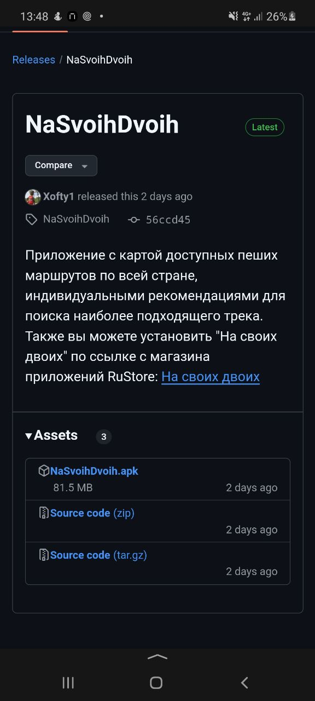
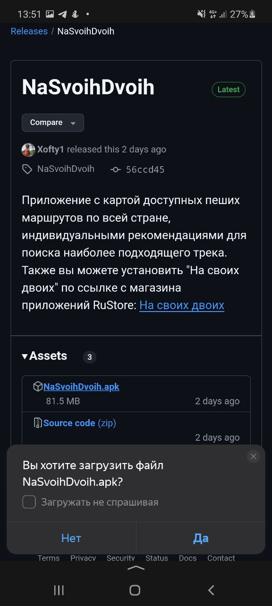
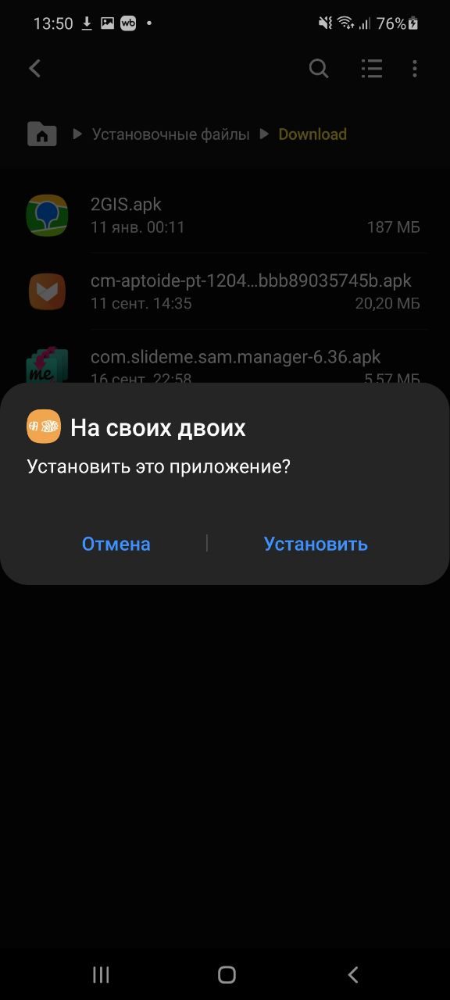
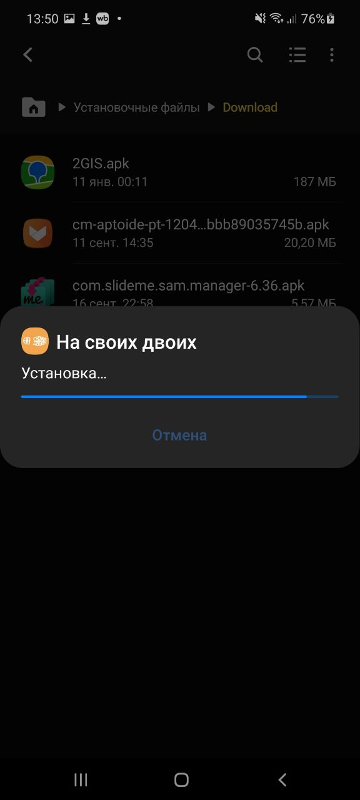
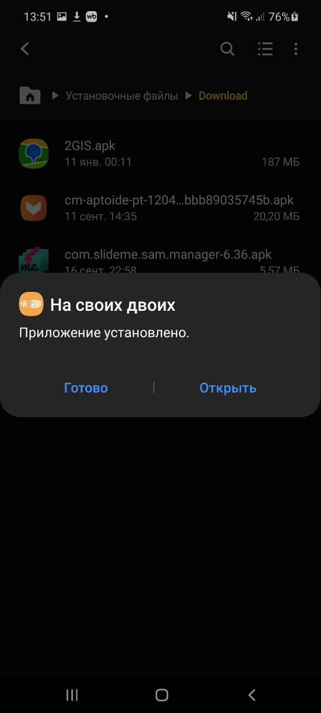

# На своих двоих

Откройте для себя невероятную красоту Северного Кавказа с приложением "На Своих Двоих" — вашим надежным гидом по пешим маршрутам в самых живописных уголках России. Вдохновляйтесь интересными направлениями, планируйте своё приключение и отправляйтесь навстречу новым открытиям.

## Возможности приложения:

- **Карта маршрутов**. Откройте карту с детально отмеченными пешими тропами по всему Северному Кавказу и выберите маршрут, который подходит именно вам.
- **Списки троп**. Исследуйте готовые маршруты, разработанные для путешествий в национальных парках и заповедниках — от лёгких прогулок до сложных многодневных походов.

- **Сохранение маршрутов**. Планируйте своё путешествие заранее, сохраняйте понравившиеся тропы и стройте индивидуальный маршрут с учётом всех деталей.

- **Самостоятельное планирование**. Все необходимые данные о маршрутах, погодных условиях, разрешениях и особенностях местности — у вас под рукой.

"На Своих Двоих" — идеальный инструмент для тех, кто любит активный отдых и хочет открыть для себя уникальные природные достопримечательности России. Погружайтесь в атмосферу свободы и вдохновения, исследуя просторы родной страны.

---

## Как установить?

1. В репозитории доступен релиз. На скриншоте ниже показано, как он выглядит:  
   

2. Нажмите на файл, который называется `NaSvoihDvoih.apk`. Появится окно с запросом подтверждения. Нажмите "Да":  
   

3. В файловом менеджере на телефоне или в браузере в разделе загрузок найдите скачанный файл и нажмите на него. Появится окно, в котором нужно выбрать "Установить":  
   

4. Начнётся установка:  
   

5. После завершения установки появится сообщение о том, что приложение успешно установлено. Нажмите кнопку "Открыть", чтобы запустить его:  
   

6. Поздравляем! Вы успешно установили приложение:  
   
